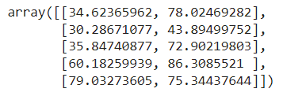
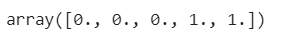
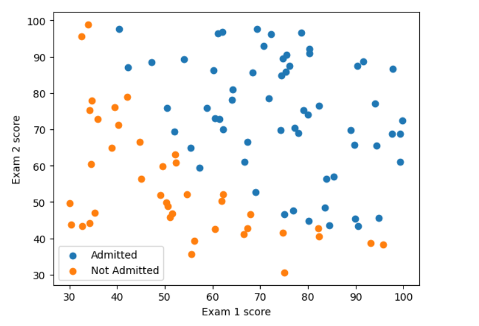
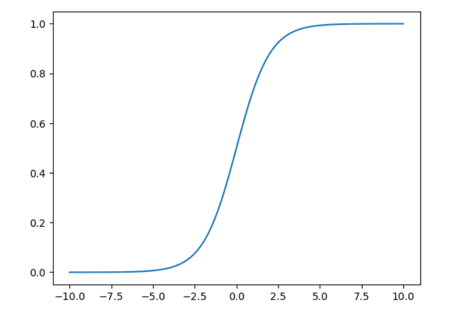
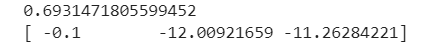
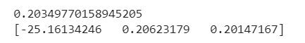
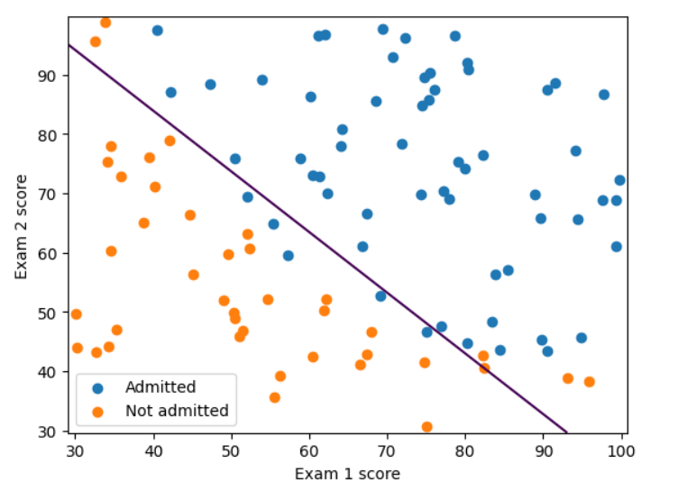
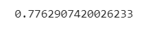
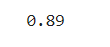

# Implementation-of-Logistic-Regression-Using-Gradient-Descent

## AIM:
To write a program to implement the the Logistic Regression Using Gradient Descent.

## Equipments Required:
1. Hardware – PCs
2. Anaconda – Python 3.7 Installation / Jupyter notebook

## Algorithm
1. Use the standard libraries in python for finding linear regression.
2. Set variables for assigning dataset values.
3. Import linear regression from sklearn.
4. Predict the values of array.
5. Calculate the accuracy, confusion and classification report by importing the required modules from sklearn.
6. Obtain the graph.

## Program:
Program to implement the the Logistic Regression Using Gradient Descent.
# Developed by: SAKTHISWAR S
# RegisterNumber:  212222230127

```python

import numpy as np
import matplotlib.pyplot as plt
from scipy import optimize

data =np.loadtxt("/content/ex2data1.txt",delimiter=',')
x = data[:,[0,1]]
y = data[:,2]

x[:5]

plt.figure()
plt.scatter(x[y == 1][:,0],x[y == 1][:,1],label="Admitted")
plt.scatter(x[y == 0][:,0],x[y == 0][:,1],label="Not Admitted")
plt.xlabel("Exam 1 score")
plt.ylabel("Exam 2 score")
plt.legend()
plt.show()


def sigmoid(z):
  return 1/(1+np.exp(-z))

plt.plot()
x_plot = np.linspace(-10,10,100)
plt.plot(x_plot,sigmoid(x_plot))
plt.show()


def costFunction (theta,x,y):
    h=sigmoid(np.dot(x,theta))
    J=-(np.dot(y,np.log(h))+np.dot(1-y,np.log(1-h)))/x.shape[0]
    grad=np.dot(x.T,h-y)/x.shape[0]
    return J,grad


x_train = np.hstack((np.ones((x.shape[0],1)),x))
theta = np.array([0,0,0])
j,grad = costFunction(theta,x_train,y)
print(j)
print(grad)

def cost(theta,x,y):
  h=sigmoid(np.dot(x,theta))
  J=-(np.dot(y,np.log(h))+np.dot(1-y,np.log(1-h)))/x.shape[0]
  return J

def gradient(theta,x,y):
    h=sigmoid(np.dot(x,theta))
    grad = np.dot(x.T,h-y)/x.shape[0]
    return grad


x_train = np.hstack((np.ones((x.shape[0],1)),x))
theta = np.array([0,0,0])
res = optimize.minimize(fun=cost, x0 = theta , args=(x_train, y), method = 'Newton-CG',jac=gradient)
print(res.fun)
print(res.x)


def plotDecisionBoundary(theta,X,y):
  x_min, x_max = X[:,0].min()-1, X[:,0].max() +1
  y_min, y_max = X[:,1].min()-1, X[:,1].max() +1
  xx,yy =np.meshgrid(np.arange(x_min, x_max,0.1),np.arange(y_min,y_max, 0.1))
  X_plot = np.c_[xx.ravel(), yy.ravel()]
  X_plot = np.hstack((np.ones((X_plot.shape[0],1)),X_plot))
  y_plot = np.dot(X_plot,theta).reshape(xx.shape)
  plt.figure()
  plt.scatter(X[y == 1][:,0],X[y== 1][:,1],label="Admitted")
  plt.scatter(X[y== 0][:,0],X[y ==0][:,1],label="Not admitted")
  plt.contour(xx,yy,y_plot,levels =[0])
  plt.xlabel("Exam 1 score")
  plt.ylabel("Exam 2 score")
  plt.legend()
  plt.show()


plotDecisionBoundary(res.x,x,y)


prob = sigmoid(np.dot(np.array([1,45,85]),res.x))
print(prob)


def predict(theta,X):
  X_train = np.hstack((np.ones((X.shape[0],1)),X))
  prob=sigmoid(np.dot(X_train,theta))
  return (prob >=0.5).astype(int)

np.mean(predict(res.x,x)==y)

```


## Output:
Array values of x



Array values of y



Exam 1 - score graph




Sigmoid function graph




x_train_grad value




y_train_grad value


Print res.x




Decision boundary - graph for exam score




Probability value




Prediction value of mean




## Result:
Thus the program to implement the the Logistic Regression Using Gradient Descent is written and verified using python programming.

